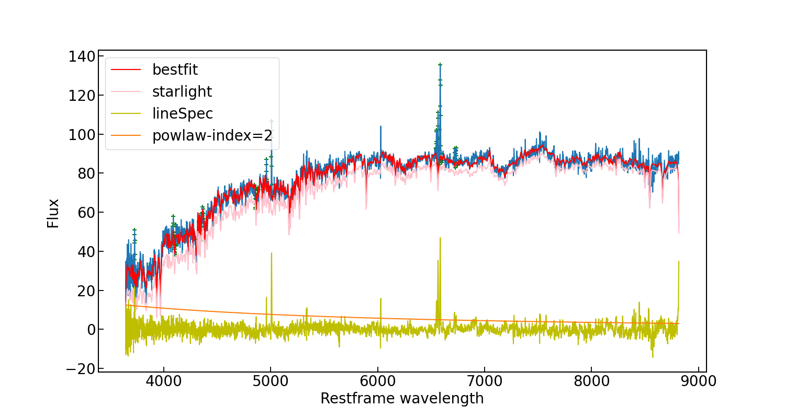

# twfit
Full spectra fitting with non-negative least-square method. 
This code models the pseudo-continuum of galaxy spectra with a non-negative linear combination 
of host stellar templates and an optional power law or black body component. To reduce the computational 
time of the fit, we used the six non-negative independent components (ICs) compressed from the library
of simple stellar populations (Bruzual & Charlot 2003) by Lu et al. 2006. We also took into account the 
potential dust attenuation effects by the host galaxy and the broadening of the stellar template caused 
by the stellar velocity dispersion.
By (Yibo Wang) wybustc@mail.ustc.edu.cn and (Tinggui Wang) twang@ustc.edu.cn 

# Acknowledgment
We are glad you use our code! If you use our code, please cite this code and the following papers: 
* [Bruzual & Charlot 2003](https://ui.adsabs.harvard.edu/abs/2003MNRAS.344.1000B/abstract) for BC03 simple stellar populations
* [Lu et al. 2006](https://ui.adsabs.harvard.edu/abs/2006AJ....131..790L/abstract) for ensemble learning for independent component analysis (EL-ICA), on the synthetic galaxy spectra from BC03 template.
* [Schlafly & Finkbeiner 2011](https://ui.adsabs.harvard.edu/abs/2011ApJ...737..103S/abstract) for the dust map used to get the ebv value of Galactic extinction
* [Fitzpatrick(1999)](https://ui.adsabs.harvard.edu/abs/1999PASP..111...63F/abstract) for the extinction law used to do the Galactic-exintction correct
* [Calzetti(2000)](https://ui.adsabs.harvard.edu/abs/2000ApJ...533..682C/abstract) for the extinction law used to model the possible host galaxy extinction
   

# Installation 
Requirements: Python3,and some neccessary packages including numpy, astropy, scipy, extinction, sfdmap, spectres, matplotlib, all installable with pip 
```
git clone https://github.com/wybustc/twfit
```

# How to run 
First, you need to set the two global used in the twfit.py as follow: 
```
PATH_ic=/path/to/17_ic.fit
PATH_dustmap=/path/to/your/dustmap
```
Then, you can run the code as follow
```
from twfit import sdssfit
sdssfit(path/to/your/sdss/spectrum/file) #fitting a spectrum from SDSS
```
or
```
from twfit import spec_fit
spec_fit(wave,flux,ivar, ra_dec=(ra,dec), redshift=redshift) #fitting an arbitraray spectrum 
```

